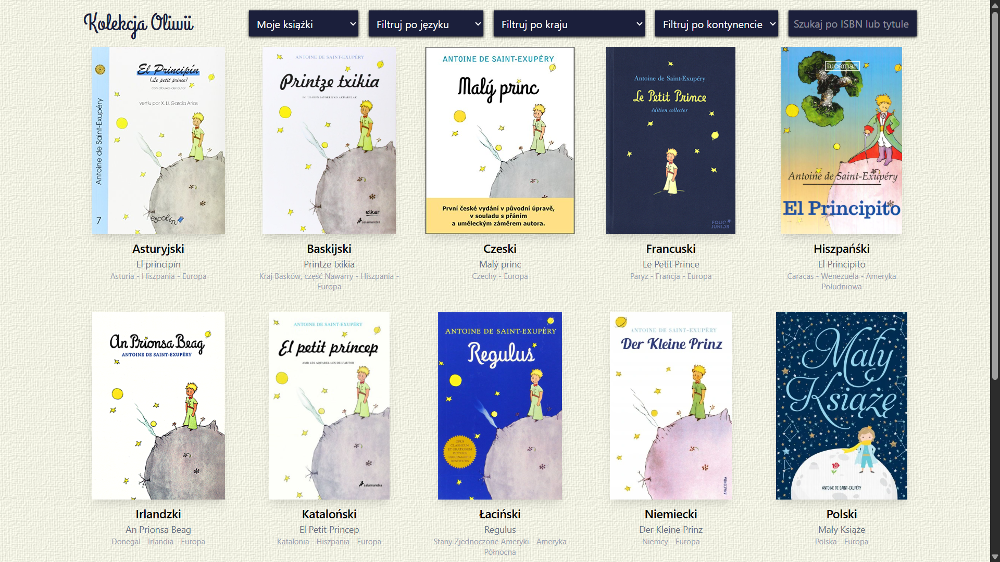
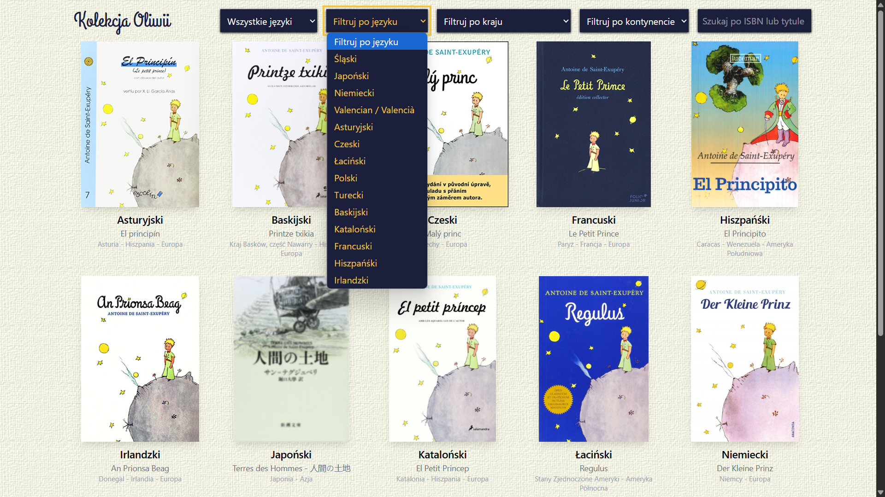
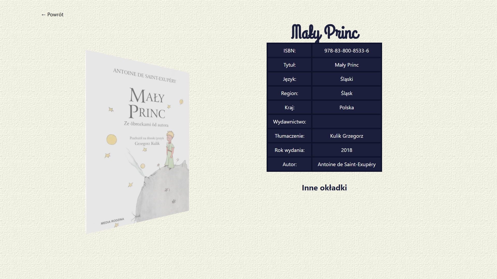
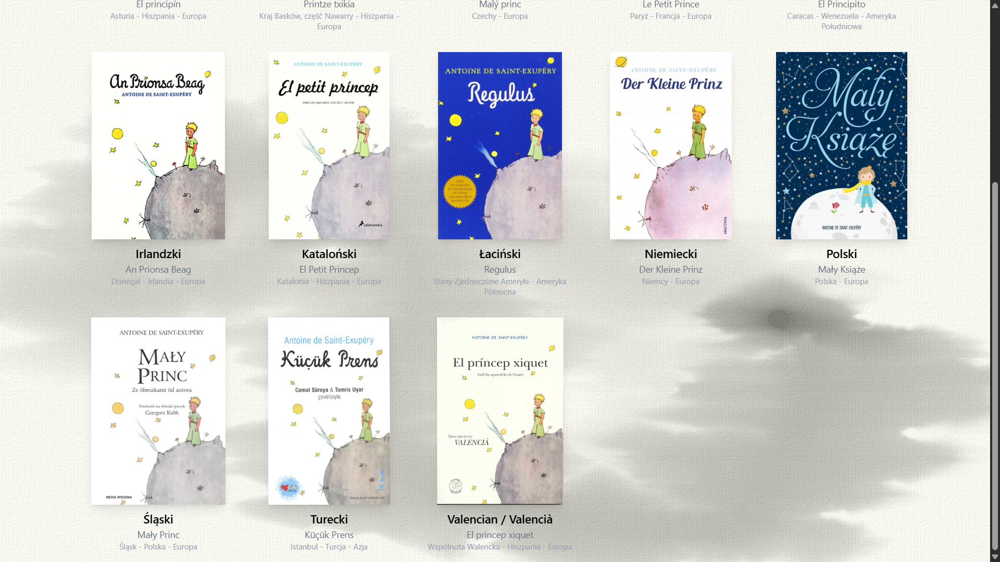
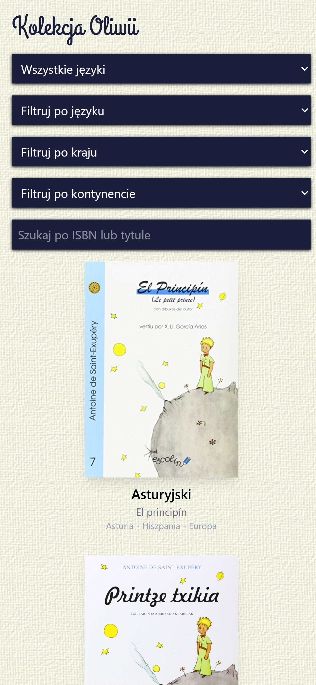
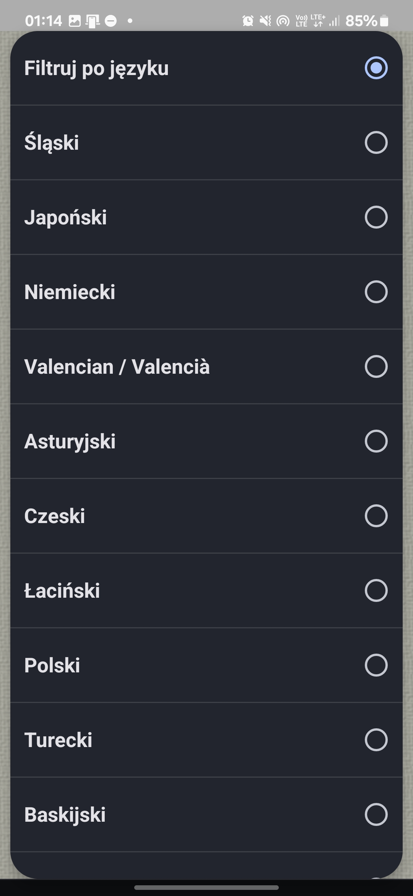
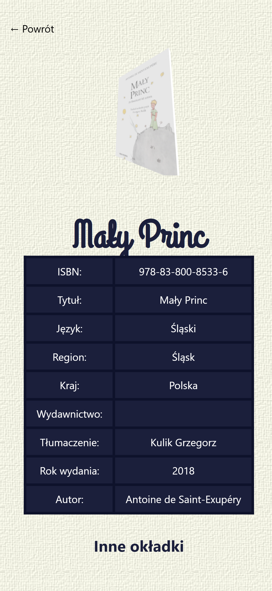

# The Little Prince Books Collection

This website showcases Oliwia Kurzeja’s collection of *The Little Prince* editions in various languages. Whenever she visits a new country, she buys a local edition of *The Little Prince* as a souvenir in that region’s language or dialect. Each book serves as a cherished reminder of the places she has visited.

<div align="center">

[](https://trzmlel.github.io/little-prince-collection/)
</div>

## Screenshots

### Desktop

|  |  |
|:--------------------------------------------------:|:------------------------------------------------:|
|  |  |


### Mobile

|  |  |  |
|:-------------------------------------------------:|:-----------------------------------------------:|:-------------------------------------------------:|

## Tech Stack

Astro, Sanity, GSAP, TailwindCSS, Three.js


<br />
<br />


## Setup

Make sure to install dependencies:

```bash
npm install
```

## Development Server

Start the development server on `http://localhost:4321`:

```bash
npm run dev
```

## Sanity data source

Projekt ładuje książki wyłącznie z Sanity.

Plik `public/books.json` i katalog `public/covers` pozostają w repozytorium bez zmian.

1. Skopiuj `.env.example` do `.env`.
2. Uzupełnij:

```bash
SANITY_PROJECT_ID=twojeProjectId
SANITY_DATASET=production
SANITY_API_VERSION=2025-01-01
```

### Sanity Studio pod `/cms`

Studio jest osadzone bezpośrednio w aplikacji Astro i działa pod ścieżką `/cms`.

1. Uzupełnij dodatkowo `.env`:

```bash
SANITY_STUDIO_PROJECT_ID=twojeProjectId
SANITY_STUDIO_DATASET=production
```

2. Uruchom aplikację:

```bash
npm run dev
```

Studio otworzysz pod `http://localhost:4321/cms`.

## Production

Build for production:

```bash
npm run build
```

## ToDo

[x] dodać przycisk do kasowania zawartości search
[x] naprawić serach po odwiedzeniu szczegółów książki
[x] przejście na strone szczegółów książki
[x] poprawić tekst w sekcji o kolekcji
[x] poprawić zawartość stopki
[x] dodać custom consol.log w konsoli przeglądarki
[x] dodać więcej animacji gsap wczytywania się strony internetowej
[x] powiększenie się cienia po najechaniu na książkę
[x] placeholder image w przypadku braku okładki
[x] kontakt w stopce
[x] informacje o twórcy w stopce
[x] custom scrollbar
[x] 404 website do poprawki
[x] dodać i sprawdzić brakujące książki w kolekcji
[x] poprosić olwiie o dopisanie swoich wspomnień z książkami
[x] dodać tłumaczenie na stronie na język angielski
[x] stworzyć header ładniejszy zamiast lewitujących elementów
[x] dodać nowy header
[x] layout poprawić dla zawartości strony [isbn]
[x] pomęczyć się z przejściami pomiędzy stronami
[x] wyrównać spaceingi na całej stronie
[] oczyścić zawartość plików z głupich ai slop linijek kodu i dodać niezbędne komentarze
[] dodać możliwość posiadania dwóch takich samych egzemplarzy
[x] naprawić wyszukiwarke i przełączniku po przejściu
[x] ujednolicić font na stronie
[x] dodać chechbox widoczne dla wszystkich w CMS
[] poprawić zdjęcie dziecięcej książeczki
